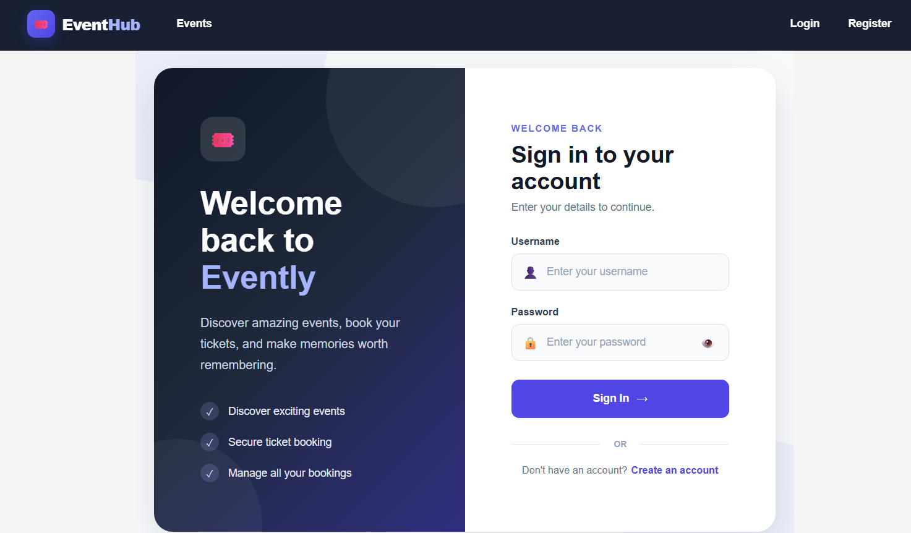
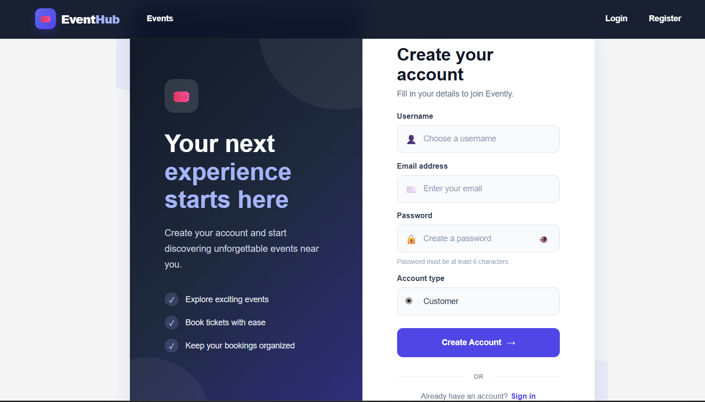
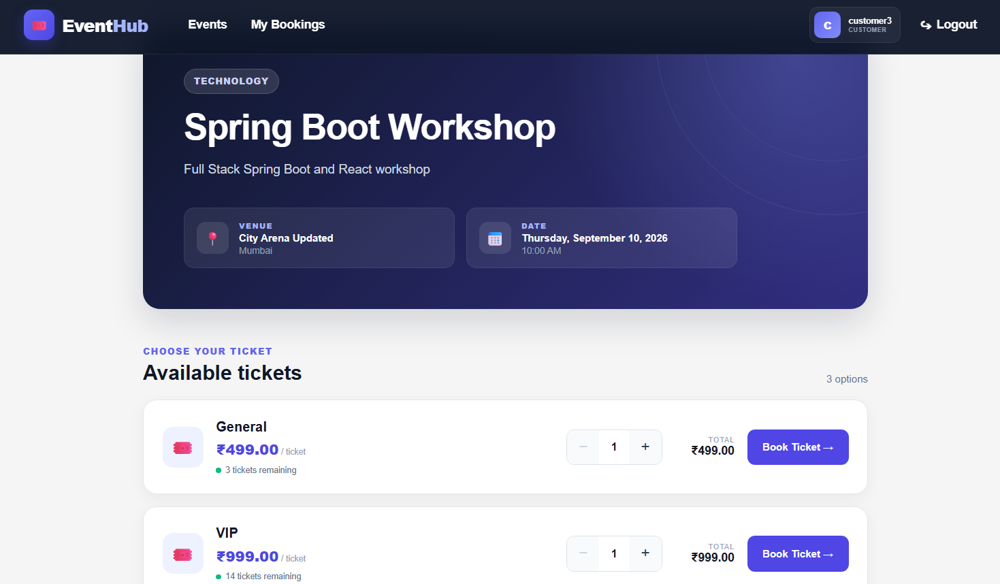
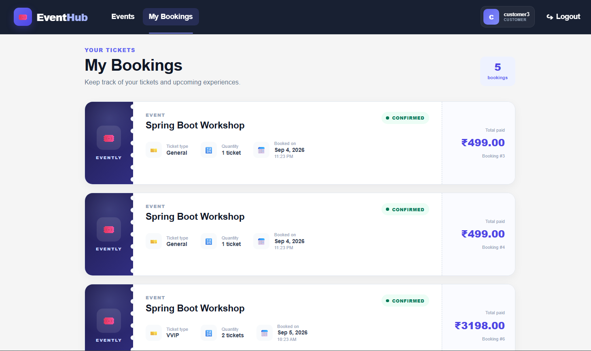
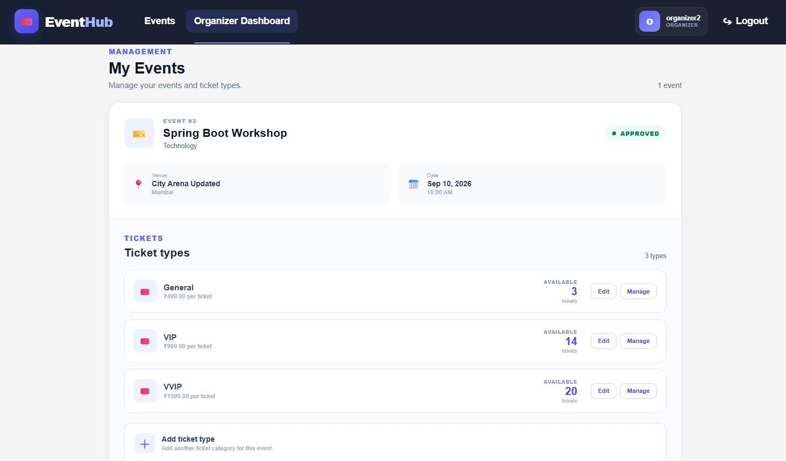
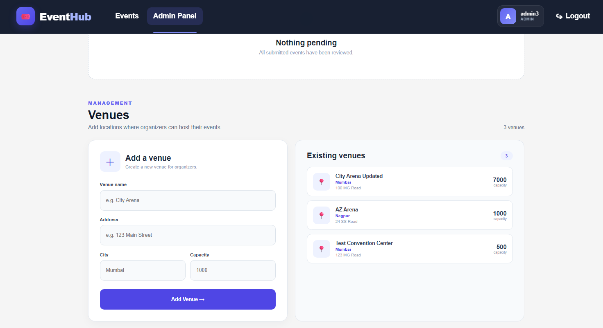

# Event Ticket Booking & Management Platform

A full-stack event ticket booking and management platform built with **Spring Boot, Spring Security, JWT, MySQL, React, and Vite**.

The application supports three roles — **ADMIN, ORGANIZER, and CUSTOMER** — with role-specific workflows for event approval, venue management, ticket management, and ticket booking.

> This README documents the **actual versions and implementation used in this project**. The original build guide was used as the project roadmap, but the final stack and structure below reflect the completed application rather than the guide's older version numbers.

---

## Features

### Authentication & Authorization

- User registration and login
- JWT-based authentication
- BCrypt password hashing
- Role-based authorization
- Protected frontend routes
- Backend method-level security
- Roles: `ADMIN`, `ORGANIZER`, `CUSTOMER`

### Event Management

- Organizers can create events linked to venues
- New events start in `PENDING` status
- Admins can approve events
- Public users can browse approved events
- Event search by city and category
- Paginated event listing
- Event details page with ticket availability

### Venue Management

- Admins can create venues
- Admins can update and delete venues
- Public venue read endpoints
- Venue information is associated with events

### Ticket Management

- Multiple ticket types per event
- Ticket name and price editing
- Organizer-only ownership checks for ticket management
- Admins can manage ticket types across organizers
- Increase ticket inventory without recreating a ticket type
- Live available quantity displayed to customers

### Booking

- Customers can book tickets
- Quantity selection before booking
- Automatic total price calculation
- Available quantity decreases after booking
- Customers can view their bookings
- Insufficient inventory returns a conflict response
- JPA optimistic locking protects ticket inventory during concurrent booking attempts

### Error Handling & Validation

- Bean Validation on request DTOs
- Global exception handling
- Validation error responses
- Resource-not-found handling
- Insufficient-ticket handling
- Optimistic-lock conflict handling
- User-friendly frontend error/success messages

---

## Tech Stack

### Backend

| Technology | Version / Implementation |
|---|---|
| Java | 17 |
| Spring Boot | 4.1.1 |
| Spring Data JPA | Spring Boot managed |
| Spring Security | Spring Boot managed |
| Spring Web MVC | Spring Boot managed |
| Bean Validation | Spring Boot managed |
| MySQL Connector/J | Spring Boot managed |
| Lombok | Spring Boot managed |
| JJWT | 0.12.6 |
| Build tool | Maven |

### Frontend

| Technology | Version |
|---|---|
| React | 19.2.8 |
| React DOM | 19.2.8 |
| Vite | 8.2.2 |
| React Router DOM | 7.18.3 |
| Axios | 1.20.0 |
| CSS | Plain CSS |
| Linting | Oxlint 1.79.0 |

### Database

- MySQL
- Database name: `eventbooking_db`
- Hibernate `ddl-auto=update` is used for local development

---

## Application Architecture

```text
                    ┌─────────────────────┐
                    │   React + Vite UI   │
                    │                     │
                    │ Auth / Events       │
                    │ Bookings / Dashboards│
                    └──────────┬──────────┘
                               │ Axios + JWT
                               ▼
                    ┌─────────────────────┐
                    │ Spring Boot REST API │
                    │                     │
                    │ Controllers         │
                    │ Services            │
                    │ Security / JWT      │
                    │ Validation / Errors │
                    └──────────┬──────────┘
                               │ JPA / Hibernate
                               ▼
                    ┌─────────────────────┐
                    │       MySQL         │
                    │   eventbooking_db   │
                    └─────────────────────┘
```

### Booking concurrency

Ticket inventory uses JPA's `@Version` optimistic locking. When two booking requests attempt to update the same ticket inventory concurrently, a stale update can fail instead of silently allowing inventory corruption. The backend converts that conflict into a `409 Conflict` response so the customer can retry.

---

## User Roles

| Role | Main Responsibilities |
|---|---|
| **ADMIN** | Manage venues, review/approve events, manage ticket types |
| **ORGANIZER** | Create events, create ticket types, edit ticket details, increase inventory, view own events |
| **CUSTOMER** | Browse approved events, select tickets, book tickets, view bookings |

---

## Main Application Pages

- `/` — Public event listing and search
- `/login` — Login
- `/register` — Registration
- `/events/:id` — Event details and ticket booking
- `/my-bookings` — Customer bookings
- `/organizer` — Organizer dashboard
- `/admin` — Admin panel

Protected routes are controlled by the user's role on the frontend and enforced again by Spring Security on the backend.

---

## Backend API Overview

### Authentication

```text
POST /api/auth/register
POST /api/auth/login
```

### Venues

```text
POST   /api/venues
GET    /api/venues
GET    /api/venues/{id}
PUT    /api/venues/{id}
DELETE /api/venues/{id}
```

### Events

```text
POST /api/events
GET  /api/events
GET  /api/events/{id}
GET  /api/events/mine
GET  /api/events/pending
PUT  /api/events/{id}/approve
```

### Ticket Types

```text
POST /api/events/{eventId}/ticket-types
GET  /api/events/{eventId}/ticket-types
PUT  /api/events/{eventId}/ticket-types/{ticketTypeId}
PUT  /api/events/{eventId}/ticket-types/{ticketTypeId}/quantity
```

### Bookings

```text
POST /api/bookings
GET  /api/bookings/my
```

---

## Project Structure

```text
event-ticket-booking/
│
├── event-ticket-backend/
│   ├── pom.xml
│   └── src/main/
│       ├── java/com/eventbooking/event_ticket_backend/
│       │   ├── config/
│       │   ├── controller/
│       │   ├── dto/
│       │   ├── entity/
│       │   ├── exception/
│       │   ├── repository/
│       │   ├── security/
│       │   └── service/
│       └── resources/
│           └── application.properties
│
├── event-ticket-frontend/
│   ├── package.json
│   ├── vite.config.js
│   └── src/
│       ├── api/
│       ├── components/
│       ├── context/
│       ├── pages/
│       ├── App.jsx
│       ├── App.css
│       └── main.jsx
│
├── docs/
│   ├── AdminPanel.png
│   ├── AvailableTickets.png
│   ├── LoginPage.png
│   ├── MyBookings.png
│   ├── OrganizerDashboard.png
│   └── RegisterPage.png
│
└── README.md
```

---

## Local Setup

### Prerequisites

Install:

- Java 17
- Maven (or use the included Maven wrapper)
- MySQL 8.x
- Node.js and npm
- A modern web browser

### 1. Clone the project

```bash
git clone git@github-project:ritikhedau18/event-ticket-booking.git
cd event-ticket-booking
```

If HTTPS is preferred, use the repository's HTTPS clone URL from GitHub instead.

### 2. Create the MySQL database

Open MySQL and run:

```sql
CREATE DATABASE eventbooking_db;
```

### 3. Configure the backend

Open:

```text
event-ticket-backend/src/main/resources/application.properties
```

Configure your local MySQL username/password and use a strong JWT secret of at least 32 characters.

Example:

```properties
spring.application.name=event-ticket-backend
spring.datasource.url=jdbc:mysql://localhost:3306/eventbooking_db
spring.datasource.username=YOUR_MYSQL_USERNAME
spring.datasource.password=YOUR_MYSQL_PASSWORD
spring.jpa.hibernate.ddl-auto=update
spring.jpa.show-sql=true
spring.jpa.properties.hibernate.dialect=org.hibernate.dialect.MySQLDialect
app.jwt.secret=YOUR_RANDOM_SECRET_AT_LEAST_32_CHARACTERS
app.jwt.expiration-ms=86400000
```

### 4. Start the backend

Windows:

```bash
cd event-ticket-backend
mvnw.cmd spring-boot:run
```

The API runs on:

```text
http://localhost:8080
```

### 5. Start the frontend

Open a second terminal:

```bash
cd event-ticket-frontend
npm install
npm run dev
```

The Vite development server normally runs on:

```text
http://localhost:5173
```

The backend CORS configuration is set up for the local frontend origin.

---

## Typical End-to-End Workflow

```text
ADMIN
  │
  ├── Creates venues
  │
  └── Approves organizer events
          │
          ▼
ORGANIZER
  │
  ├── Creates an event
  ├── Adds ticket types
  ├── Edits ticket name/price
  └── Increases ticket inventory
          │
          ▼
CUSTOMER
  │
  ├── Browses approved events
  ├── Selects ticket quantity
  ├── Books tickets
  └── Views My Bookings
```

---

## Validation & Conflict Scenarios Tested

The completed application was tested through the main role workflows, including:

- Registration for all three roles
- Login and JWT authentication
- Admin venue management
- Organizer event creation
- Admin event approval
- Public event search/listing
- Ticket type creation
- Organizer ticket editing
- Organizer inventory increase
- Customer ticket booking
- Available quantity reduction after booking
- My Bookings display
- Overbooking / insufficient inventory conflict
- Unauthorized organizer access to another organizer's ticket type
- Admin management of another organizer's ticket type

---

## UI Screenshots

### Login


### Registration


### Available Tickets


### My Bookings


### Organizer Dashboard


### Admin Panel


## Development Notes

- The frontend uses Axios through a shared API instance and an authentication context for JWT-backed sessions.
- Backend authorization is enforced independently of frontend route protection.
- Events are initially created as `PENDING` and become publicly discoverable after admin approval.
- Ticket inventory is represented by both total and available quantity.
- Ticket updates are restricted by organizer ownership or admin privileges.
- `@Version` on `TicketType` provides optimistic locking for concurrent inventory updates.
- `GlobalExceptionHandler` provides consistent API error responses.

---

## Build Commands

### Backend

```bash
cd event-ticket-backend
mvnw.cmd clean package
```

### Frontend

```bash
cd event-ticket-frontend
npm run build
```

---

## Project Status

The core platform is complete and has been tested through the main ADMIN → ORGANIZER → CUSTOMER workflow, including ticket inventory management and booking conflict handling.

The project was developed incrementally following the supplied build guide's feature order, with the final README updated to reflect the **actual implementation and dependency versions used in the finished project**.
